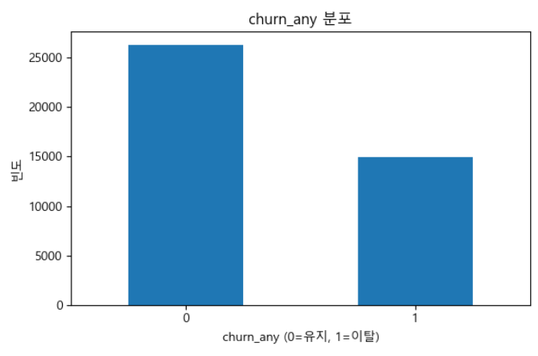
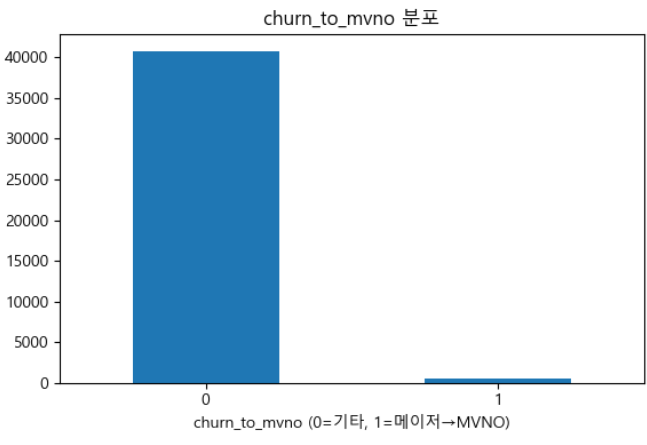

# KMP 기반 통신사 고객 이탈 예측 프로젝트

## 프로젝트 소개

본 프로젝트는 한국미디어패널(KMP) 2020~2025 개인조사 데이터를 활용하여 통신사 고객 이탈 가능성을 예측한 팀 프로젝트이다.

동일 개인의 연도별 변화를 반영하기 위해 `pid` 기준의 transition 기반 long panel 데이터를 구축하였고, 다음 두 가지 예측 문제를 중심으로 분석을 진행하였다.

- `churn_any`: 전년 대비 이용 통신사가 변경되었는지 여부
- `churn_to_mvno`: 전년 메이저 통신사(1/2/3) 이용자가 다음 해 알뜰폰(MVNO=4)으로 이동했는지 여부

본 프로젝트는 단순 성능 비교를 넘어, 통신사 이탈에 영향을 주는 주요 변수와 해석 가능한 인사이트를 도출하는 것을 목표로 하였다.

---

## 팀 소개

| 팀원 1 | 팀원 2 | 팀원 3 | 팀원 4 | 팀원 5 |
|--------|--------|--------|--------|--------|
| 이름: 윤찬호<br>GitHub ID: `member1` | 이름: 홍완기<br>GitHub ID: `member2` | 이름: 홍진서<br>GitHub ID: `member3` | 이름: 김용욱<br>GitHub ID: `member4` | 이름: 전승권<br>GitHub ID: `member5` |


---

## 기술 스택

- Language: Python
- Data Processing: Pandas, NumPy
- Visualization: Matplotlib, Seaborn
- Machine Learning: Scikit-learn, XGBoost
- Environment: Jupyter Notebook

---

## 폴더 구조

```bash
.
├── data
│   └── processed
│       └── train_df_2020_2025.csv
├── src
│   └── preprocess_kmp.py
├── notebooks
│   ├── 00_eda_overview.ipynb
│   ├── 01_preprocessing_check.ipynb
│   ├── 02_churn_any_baseline.ipynb
│   ├── 03_churn_to_mvno_baseline.ipynb
│   ├── 04_churn_any_cv_tuning.ipynb
│   └── 05_final_summary.ipynb
└── README.md
```

### 파일 설명
- `src/preprocess_kmp.py`  
  원천 데이터를 전처리하고 transition 기반 최종 데이터셋을 생성하는 스크립트

- `data/processed/train_df_2020_2025.csv`  
  전처리 완료 후 생성된 최종 학습용 데이터셋

- `00_eda_overview.ipynb`  
  데이터 기본 구조 및 라벨/변수 분포 확인

- `01_preprocessing_check.ipynb`  
  전처리 결과 점검 및 전환형 구조 검증

- `02_churn_any_baseline.ipynb`  
  churn_any baseline 모델 비교

- `03_churn_to_mvno_baseline.ipynb`  
  churn_to_mvno baseline 모델 비교 및 한계 확인

- `04_churn_any_cv_tuning.ipynb`  
  churn_any 교차검증 및 RandomForest 튜닝

- `05_final_summary.ipynb`  
  전체 프로젝트 결과 요약 및 최종 정리

---

## 프로젝트 목표

- KMP 원천 데이터를 기반으로 통신사 이탈 예측용 전환형 데이터셋을 구축한다.
- `churn_any`와 `churn_to_mvno`를 분리하여 문제 구조와 난이도를 비교한다.
- Accuracy뿐 아니라 Recall, F1, PR-AUC 중심으로 실질적인 탐지 성능을 해석한다.
- 통신사 이탈에 영향을 줄 수 있는 비용, 이용 특성, 개인 배경 변수의 의미를 함께 확인한다.
- 단순 성능 비교를 넘어 해석 가능한 인사이트와 데이터 한계를 함께 정리한다.

---

## 데이터 설명

### 사용 데이터
- 한국미디어패널(KMP) 2020~2025 개인조사 CSV (`p20 ~ p25`)
- 코드북 `P_codebook_v32.xlsx`

### 데이터 구성 방식
원천 데이터는 `pid` 기준으로 전년(`t-1`)과 다음 해(`t`)를 연결하여 transition 기반 long panel 형태로 재구성하였다.  
즉, 한 행은 한 개인의 `year_t0 → year_t1` 전환을 의미한다.

예시
- `2020 → 2021`
- `2021 → 2022`
- `2022 → 2023`
- `2023 → 2024`
- `2024 → 2025`

최종 데이터셋은 총 `41,299행`, `17컬럼`으로 구성하였다.

### 원본 데이터 안내
- 원본 KMP CSV 파일은 용량 문제로 본 저장소에 포함하지 않았다.
- 따라서 `data/raw/` 폴더는 비워두었거나 업로드하지 않은 상태이며, 분석은 별도로 확보한 원본 데이터를 기준으로 진행하였다.

---

## 전처리 방법

전처리 파이프라인에서는 아래 기준을 적용하였다.

- 결측 코드 `9999`, `9998`, `9997`를 `NaN`으로 변환
- 문자열 공백 및 NBSP 제거
- 통신사 변수는 유효값 `{1, 2, 3, 4}`만 유지
- 일부 이진 변수는 `1/2 → 1/0`으로 변환
- `pid`, `year_t0`, `year_t1` 기준 중복 제거
- 예측 입력에는 항상 `t-1` 시점 변수만 사용
- `telco` 관련 직접 정보는 입력 변수에서 제외하여 데이터 누수를 방지

또한 기존 통신 이용 특성 변수에 더해 아래 개인 특성 변수를 추가 반영하였다.

- `age1`: 나이(만 연령)
- `income1`: 개인 월평균 소득
- `job1`: 직업 유무

이를 통해 통신 이용 특성뿐 아니라 개인의 생애주기와 경제적 배경까지 함께 반영하는 분석 구조를 구성하였다.

---

## 사용 변수

본 프로젝트에서는 총 10개 변수군을 사용하였다.

- 스마트폰 구분
- 음성 무제한 서비스 가입 여부
- 데이터 무제한 서비스 가입 여부
- 월평균 휴대폰 이용 총 금액
- 월평균 기기 할부금
- 휴대폰 결합상품 가입 여부
- 휴대폰 요금 부담자
- 나이 또는 연령대
- 개인 월평균 소득
- 직업 유무

---

## 데이터 구조 및 라벨 분포

EDA 및 전처리 점검 결과, 라벨 분포는 다음과 같았다.

- `churn_any`: 약 36.3%
- `churn_to_mvno`: 약 1.25%

이를 통해 다음을 확인할 수 있었다.

- `churn_any`는 비교적 표본이 충분한 문제
- `churn_to_mvno`는 매우 희소한 이벤트로 클래스 불균형이 큰 문제
- 따라서 두 문제는 같은 기준으로 해석하면 안 되며, 서로 다른 평가 관점이 필요하다




---

## 분석 흐름

### 1. `00_eda_overview.ipynb`
- 데이터 기본 구조 확인
- 라벨 분포 확인
- 주요 변수 분포 및 기초 관계 확인

### 2. `01_preprocessing_check.ipynb`
- 전처리 결과 점검
- 전환형 구조 확인
- 추가 변수(`age1`, `income1`, `job1`) 반영 여부 검증

### 3. `02_churn_any_baseline.ipynb`
- `churn_any` 단일 hold-out baseline 모델 비교

### 4. `03_churn_to_mvno_baseline.ipynb`
- `churn_to_mvno` baseline 모델 비교
- threshold 조정 및 불균형 대응 기법 확인

### 5. `04_churn_any_cv_tuning.ipynb`
- `GroupKFold` 기반 `churn_any` 교차검증
- `RandomForest` 하이퍼파라미터 튜닝
- threshold 비교 및 해석

### 6. `05_final_summary.ipynb`
- 전체 프로젝트 결과 요약
- 문제별 핵심 결론 및 한계 정리

---

## 주요 결과

### 1. churn_any 분석 결과
`churn_any`는 일반적인 통신사 변경 여부를 예측하는 문제로, hold-out baseline 비교와 GroupKFold 기반 교차검증·튜닝을 함께 진행하였다.

- hold-out baseline에서는 `DecisionTree`가 가장 강한 탐지형 성능을 보였다.
- GroupKFold 기준 baseline에서도 `DecisionTree`가 가장 높은 Recall과 F1을 보였다.
- 튜닝 이후에는 `RandomForest`가 보다 실사용에 가까운 최종 후보 모델로 정리되었다.


### 2. churn_to_mvno 분석 결과
`churn_to_mvno`는 전체 데이터 기준 양성 비율이 약 1.25%에 불과한 매우 희소한 문제였다.

- 가장 안정적인 baseline은 `LogisticRegression`이었다.
- `DecisionTree`는 탐지형 대안으로 해석할 수 있었다.
- threshold 조정만으로는 성능 한계가 분명했다.
- 희소 클래스와 변수 정보 한계가 동시에 존재하는 문제임을 확인하였다.


---

## 공통 인사이트

두 문제를 함께 보면 공통적으로 비용 및 이용 특성이 중요한 축으로 작용하였다.  
특히 아래 변수들이 반복적으로 중요한 신호로 나타났다.

- 스마트폰 구분
- 월평균 휴대폰 이용 총 금액
- 월평균 기기 할부금
- 나이/연령대
- 개인 월평균 소득

즉 고객 이탈은 단순한 통신 이용 행태만으로 설명되지 않고,  
비용 관련 변수, 단말 및 이용 특성, 개인 배경 특성이 함께 작용하는 문제임을 확인할 수 있었다.


---

## 한계 및 향후 개선 방향

이번 프로젝트는 `t-1` 시점의 상태값을 바탕으로 통신사 이탈을 예측했다는 점에서 의미가 있었지만,  
특히 `churn_to_mvno`처럼 희소한 문제에서는 변수 정보와 라벨 구조의 한계도 함께 확인할 수 있었다.

향후에는 아래 방향으로 확장하면 분석의 실효성을 더 높일 수 있다.

1. 변화량 중심 변수 확장  
현재는 `t-1` 시점의 상태값을 주로 사용했지만, 실제 이탈은 절대 수준보다 변화 폭에 더 민감할 수 있다.  
따라서 월평균 휴대폰 이용 금액 변화, 기기 할부금 변화, 서비스 가입 여부 변화처럼 `t-1 → t` 직전의 변화량 변수를 추가하면 이탈 신호를 더 잘 포착할 수 있다.

2. MVNO 이동에 특화된 추가 변수 확보  
`churn_to_mvno`는 단순 통신사 변경보다 훨씬 희소하고 구조적으로 어려운 문제였다.  
향후에는 약정 만료 여부, 요금제 변경 이력, 단말 교체 주기, 결합상품 유지 여부처럼 MVNO 이동과 직접적으로 연결될 수 있는 변수를 추가해 문제 자체의 설명력을 높일 필요가 있다.

3. 희소 라벨 대응 전략 고도화  
`churn_to_mvno`에서는 threshold 조정만으로는 한계가 분명했다.  
따라서 향후에는 class weight 조정, resampling, 불균형 특화 앙상블 등 희소 클래스 대응 전략을 보다 체계적으로 비교할 필요가 있다.

4. 시간 일반화 성능 검증  
현재 분석은 transition 구조를 반영했지만, 실제 활용 가능성을 보려면 특정 연도에서 학습하고 다음 연도로 평가하는 방식의 시간 기반 검증도 함께 필요하다.  
이를 통해 모델이 현재 데이터에만 맞는지, 이후 시점에도 일반화되는지를 더 명확하게 확인할 수 있다.

---

## 실행 방법

### 1. 원본 데이터 준비
본 프로젝트는 KMP 원본 CSV 파일이 별도로 필요하다.  
용량 문제로 저장소에는 포함하지 않았으므로, 사용 전 직접 원본 데이터를 준비해야 한다.

### 2. 전처리 데이터 생성
```bash
python src/preprocess_kmp.py
```

### 3. 노트북 실행
전처리된 `train_df_2020_2025.csv`를 기준으로 아래 노트북을 순서대로 실행한다.

- `00_eda_overview.ipynb`
- `01_preprocessing_check.ipynb`
- `02_churn_any_baseline.ipynb`
- `03_churn_to_mvno_baseline.ipynb`
- `04_churn_any_cv_tuning.ipynb`
- `05_final_summary.ipynb`

---

## 최종 결론

이번 프로젝트에서는 통신사 고객 이탈을 `churn_any`와 `churn_to_mvno`로 나누어 분석하였다.

`churn_any`는 상대적으로 표본이 충분한 문제였으며, baseline 비교와 튜닝을 통해 실제 활용 가능성이 있는 방향을 확인할 수 있었다.

반면 `churn_to_mvno`는 매우 희소한 문제로, baseline과 threshold 조정만으로는 실질적인 성능 개선에 한계가 있었다.  
따라서 이 문제는 희소 클래스 문제의 구조적 난점을 이해하고, 향후 데이터 확장과 불균형 대응 전략이 필요함을 확인했다는 점에서 의미가 있었다.

즉 본 프로젝트의 핵심 성과는 단순 점수 비교가 아니라,  
통신사 고객 이탈을 비용 관련 변수, 이용 특성, 단말 특성, 개인 배경이 함께 작동하는 문제로 해석 가능한 형태로 정리했다는 데 있다.
